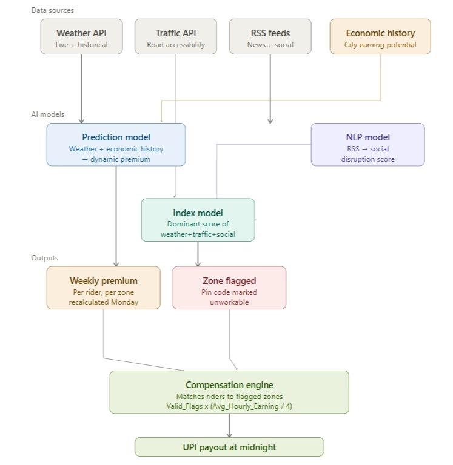
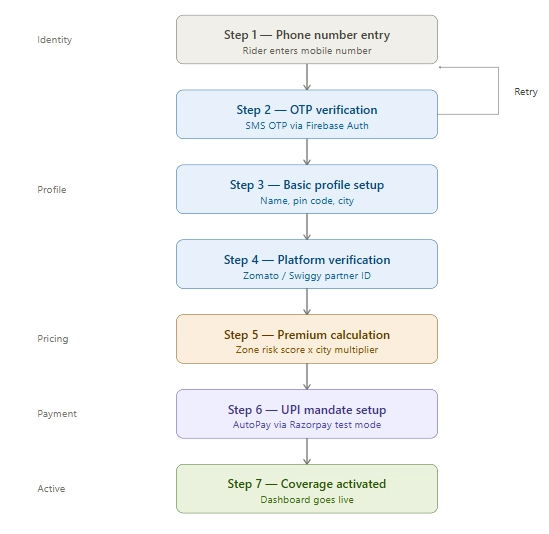
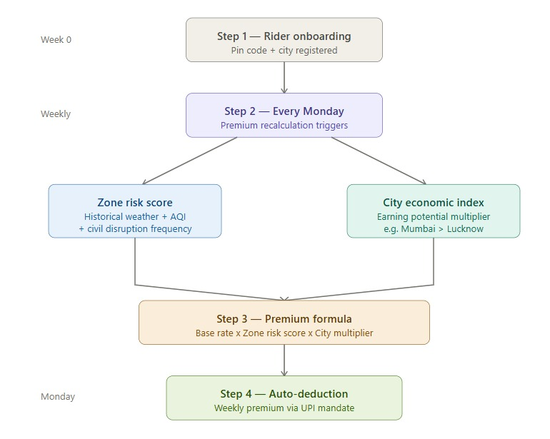
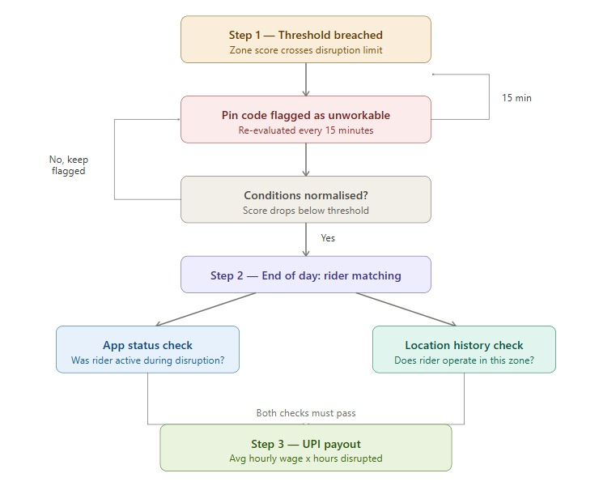

# D.A.S.H. – Disruption Aware Safety Harbour

## Overview



## Table of Content
[D.A.S.H. – Disruption Aware Safety Harbour](#dash--disruption-aware-safety-harbour)
  - [Overview](#overview)
  - [Table of Content](#table-of-content)
  - [Problem Statement](#problem-statement)
  - [Target Persona](#target-persona)
  - [What we’re solving?](#what-were-solving)
  - [How we are doing this?](#how-we-are-doing-this)
  - [Key Features](#key-features)
  - [Architecture and Intelligence](#architecture-and-intelligence)
    - [1. Data Sources & Integrations](#2-nlp-model--social-disruption-score)
    - [2. NLP Model — Social Disruption Score](#2-nlp-model--social-disruption-score)
    - [3. Index Calculation Model — Pin Code Disruption Score](#3-index-calculation-model--pin-code-disruption-score)
      - [Weather score (using Weather API)](#weather-score-using-weather-api)
      - [Traffic score (using Traffic API)](#traffic-score-using-traffic-api)
      - [Social disruption score (obtained with the NLP model)](#social-disruption-score-obtained-with-the-nlp-model)
    - [4. Dynamic Pricing Model](#4-dynamic-pricing-model)
    - [5. Compensation engine](#5-compensation-engine)
  - [System Workflow](#system-workflow)
    - [1. User Registration Flow](#1-user-registration-flow)
      - [Step 1 — Phone number entry and OTP verification](#step-1--phone-number-entry-and-otp-verification)
      - [Step 2 — Basic profile setup](#step-2--basic-profile-setup)
      - [Step 3 — Platform verification](#step-3--platform-verification)
      - [Step 4 — Premium calculation](#step-4--premium-calculation)
      - [Step 5 — UPI mandate setup](#step-5--upi-mandate-setup)
      - [Step 6 — Coverage activated](#step-6--coverage-activated)
    - [2. Premium Model Work Flow](#2-premium-model-work-flow)
      - [Step 1 — Rider onboarding](#step-1--rider-onboarding)
      - [Step 2 — Dynamic Pricing Model](#step-2--dynamic-pricing-model)
      - [Step 3 — Auto-deduction](#step-3--auto-deduction)
    - [3. Payout Flow](#3-payout-flow)
      - [Step 1 — Pin code flagging](#step-1--pin-code-flagging)
      - [Step 2 — End of day: Rider matching](#step-2--end-of-day--rider-matching)
      - [Step 3 — UPI payout](#step-3--upi-payout)
  - [Tech Stack](#tech-stack)
  - [Fraud Detection](#fraud-detection)
  - [Platform Choice](#platform-choice)
    - [Why PWA instead of native apps?](#why-pwa-instead-of-native-apps)
  - [Development Plan](#development-plan)
    - [Phase 1 — Foundation](#phase-1--foundation)
    - [Phase 2 —Automation & Intelligence](#phase-2-automation--intelligence)
    - [Phase 3 — Polish & Scale](#phase-3--polish--scale)
  - [Financial Viability & Sustainability of DASH](#financial-viability--sustainability---dash)


## Problem Statement

India's gig economy is built on the backs of millions of food delivery riders working for platforms like Zomato and Swiggy. 

These riders operate as independent contractors — earning per order, with **no fixed salary, no employer benefits, and no financial safety net** of any kind. Their income is entirely dependent on their ability to ride disruptions cause gig workers to lose anywhere between 20–30% of their monthly earnings, yet **not a single rupee of that loss is compensated** by anyone.

## Target Persona

Zomato and Swiggy riders spend their entire working day outdoors on two-wheelers with no indoor alternative.

Every disruption we cover hits them directly:

- Heavy rain makes roads dangerous, halting deliveries entirely
- Extreme heat makes prolonged outdoor riding physically impossible
- Severe AQI forces riders off the road with no indoor fallback
- Curfews and bandhs shut down both restaurants and customers simultaneously

With no base wage and no employer safety net, **a disrupted day is simply a day of zero income**.

## What we’re solving?

When a disruption hits, a Zomato rider has **three options** - ride anyway and risk their safety, stay home and absorb the full financial loss, or borrow money to cover daily expenses.  

We are building that **fourth option** — **an AI-powered parametric insurance platform that automatically detects disruptions in a rider's operative zone, triggers a claim without any action from the rider, and processes an income replacement payout**. No forms, no waiting, no friction.

## How we are doing this?

We are building **DASH**, which provides gig workers with premiums dynamically calculated using historical weather, AQI, and civil disruption data specific to their operative zone.

When a disruption is detected in a rider's zone, DASH **automatically** calculates the income they were unable to earn based on their historical average earnings. We **flag affected areas** and **for how long they were affected** then at the end of each day, the compensation is transferred directly to their UPI account.

```
Compensation = Average hourly wage × Hours lost to disruption
```

## Key Features

- **Dynamic premium calculation :** Riders in historically high-risk zones pay a higher premium, riders in safer zones pay less.
- **Real-time zone disruption scoring :** Every active pin code is assigned a live disruption score, recalculated every 15 minutes using three real-time data sources:
    - Weather API — current rainfall, temperature, and AQI readings for that zone
    - Traffic data — road accessibility and congestion levels indicating whether movement is possible
    - RSS feeds — active curfew, bandh, or strike alerts for that specific area
- **Automated end-of-day compensation :** At the end of each disrupted day, DASH automatically identifies all active subscribers within flagged pin codes and calculates their payout. Payment is credited directly to the rider's UPI account overnight.
- **Anti-fraud architecture:** Since triggers are zone-based and derived entirely from external APIs , not rider-reported location, there is nothing for a rider to spoof.
- **Rider-friendly onboarding :** Designed for low digital literacy — simple PWA-based signup, weekly payments auto-deducted and credited via UPI.

*****Additional Features*****

- **Resilience Reward** : Riders who **complete deliveries during moderate or harsh conditions** **receive a bonus** credited directly to their UPI account alongside their nightly compensation payout.

## Architecture and Intelligence

### 1. Data Sources & Integrations

1. Weather API: **OpenWeatherMap**
    
    Example response :
    
    ```json
    {
      "coord": {
        "lon": 73.1812,
        "lat": 22.3072
      },
      "weather": [
        {
          "id": 500,
          "main": "Rain",
          "description": "light rain"
        }
      ],
      "main": {
        "temp": 32.5,
        "feels_like": 35.1,
        "humidity": 68,
        "pressure": 1008
      },
      "visibility": 6000,
      "wind": {
        "speed": 5.2
      },
      "rain": {
        "1h": 3.5
      },
      "name": "Vadodara"
    }
    ```
    
2. Traffic API: **Google Distance Matrix**
    
    Example response :
    
    ```json
    {
      "destination_addresses": ["Mumbai, Maharashtra, India"],
      "origin_addresses": ["Bandra, Mumbai, Maharashtra, India"],
      "rows": [
        {
          "elements": [
            {
              "distance": {
                "text": "8.4 km",
                "value": 8400
              },
              "duration": {
                "text": "28 mins",
                "value": 1680
              },
              "duration_in_traffic": {
                "text": "45 mins",
                "value": 2700
              },
              "status": "OK"
            }
          ]
        }
      ],
      "status": "OK"
    }
    ```
    
    > All location inputs are normalized from PIN code to latitude–longitude before querying external APIs to ensure higher spatial accuracy.
    > 
3. RSS feed: 
    - Times of India RSS — `https://timesofindia.indiatimes.com/rss.cms`
    - NDTV RSS — `https://feeds.feedburner.com/ndtvnews-top-stories`
4. Platform mock API 
    
    Example : 
    
    ```json
    {
      "rider_id": "ZOM-4521",
      "name": "Rahul Sharma",
      "city": "Mumbai",
      "operative_pincode": "400051",
      "status": "active",
      "avg_hourly_earning": 120,
      "current_session": {
        "started_at": "2024-07-15T18:00:00",
        "deliveries": [
          {
            "order_id": "ORD-8821",
            "picked_up_at": "2024-07-15T18:45:00",
            "delivered_at": "2024-07-15T19:10:00",
            "delivery_pincode": "400051",
            "zone_score_at_delivery": 0.74,
            "base_earning": 55
          }
        ]
      },
      "historical_delivery_pincodes": ["400051", "400052", "400049"]
    }
    ```

### **2. NLP Model — Social Disruption Score**

RSS feeds from local news sources are continuously monitored for civil disruptions. Raw news text is unstructured and noisy, so a **dedicated NLP model** processes it to extract three things:

1. **Event classification** — is this article reporting an active disruption or just discussing a past one? The model distinguishes between "curfew imposed in Dharavi today" versus "curfew was lifted last week."
2. **Location extraction** — which specific area, district, or pin code does this event affect? The model maps the mentioned locality to the corresponding pin codes in DASH's operative zone database.
3. **Severity scoring** —  A full curfew scores higher than a localised road blockage. The model assigns a severity score based on the nature and scale of the reported event.

```jsx
Social_disruption_score = f(event_type, affected_area, severity)
```

A pin code receiving a high social disruption score is flagged as delivery-impossible for that time window, feeding directly into the index calculation model alongside weather and traffic data.

> ***Social disruption score and weather score from weather API is then used to flag the pincodes***
> 

### **3. Index Calculation Model — Pin Code Disruption Score**

The index model runs every 15 minutes, combining inputs from three real-time sources for each pin code:

- **Weather score** — derived from live weather API data, reflecting rain intensity, temperature, and AQI levels in that zone
- **Traffic score** — derived from live traffic data, reflecting road accessibility and movement possibility
- **Social disruption score** — derived from the NLP model, reflecting active curfews, bandhs, or strikes in that area

#### **Weather score (using Weather API)**

| Condition | Threshold | Score |
| --- | --- | --- |
| Light rain / normal temp / low AQI | Below warning levels | 0.0 – 0.3 |
| Moderate rain / high temp / moderate AQI | Approaching limits | 0.4 – 0.6 |
| Heavy rain >50mm / temp >42°C / AQI >300 | Exceeds safe limits | 0.7 – 1.0 |
<details>
<summary>Detailed Calculation of Weather Score</summary>

- Rain_Intensity: Score (0–0.30)

  ```jsx
  function rainScore(rain_mm_per_hr) {
    if (!rain_mm_per_hr) return 0;
    if (rain_mm_per_hr < 2) return 0.10;
    if (rain_mm_per_hr < 7) return 0.20;
    return 0.30;
  }
  ```

- Temperature: Score (0–0.15)

  ```jsx
  function tempScore(temp) {
    if (temp >= 20 && temp <= 30) return 0;
    if (temp > 30 && temp <= 38) return 0.08;
    if (temp > 38) return 0.15;
    if (temp < 10) return 0.10;
    return 5;
  }
  ```

- Wind_Speed: Score (0–0.15)

  ```jsx
  function windScore(kmh) {
    if (kmh < 10) return 0;
    if (kmh < 25) return 0.05;
    if (kmh < 40) return 0.10;
    return 0.15;
  }
  ```

- Visibility: Score (0–0.15)

  ```jsx
  function visibilityScore(vis) {
    if (vis > 8000) return 0;
    if (vis > 4000) return 0.05;
    if (vis > 1000) return 0.10;
    return 0.15;
  }
  ```

- Extreme_Conditions: Score (0–0.15)

  ```jsx
  function extremeScore(weatherMain) {
    if (weatherMain.includes("Thunderstorm")) return 0.10;
    if (weatherMain.includes("Extreme")) return 0.15;
    return 0;
  }
  ```

- Road_Condition: Score (0–0.10)

  Derived using **past 3–6 hours rain**

  ```jsx
  function roadScore(rainLastHours) {
    if (rainLastHours === 0) return 0; // dry road
    if (rainLastHours < 10) return 0.05;  // wet
    return 0.10;  // probably water logged
  }
  ```
</details>

        

#### **Traffic score (using Traffic API)**

| Condition | Threshold | Score |
| --- | --- | --- |
| Roads clear | Normal flow | 0.0 – 0.3 |
| Heavy congestion | Significant slowdown | 0.4 – 0.6 |
| Roads blocked / inaccessible | Movement impossible | 0.7 – 1.0 |

#### **Social disruption score (obtained with the NLP model)**

| Condition | Threshold | Score |
| --- | --- | --- |
| No events reported | No RSS alerts | 0.0 – 0.3 |
| Localized disruption | Single source alert | 0.4 – 0.6 |
| Full curfew / bandh | Multiple source corroboration | 0.7 – 1.0 |

Rather than averaging these scores together, the model takes the **dominant score.**

This is intentional, a zone only needs one condition to make delivery impossible. **A clear sunny day with a curfew is just as unworkable as a flooded road with no civil disruption**.

```
Zone_disruption_score = max(weather_score, traffic_score, social_disruption_score)
```

If the dominant score exceeds **`0.7`**, the pin code is flagged as **unworkable** for that 15-minute window

### 4. Dynamic Pricing Model

Riders across Indian cities earn differently and face vastly different levels of environmental and social disruption. Keeping both factors in mind, our dynamic pricing model calculates each rider's weekly premium by combining their city's economic index with their operative zone's historical risk score , ensuring every rider pays a premium that is proportional to both what they earn and the real risk they face.

**Base rate**

The base rate is set at ₹70/week : the minimum premium any rider pays regardless of zone or city.

**Factor 1 — Zone risk score (0.0 to 1.0)**

Derived from 1–3 years of historical data for that specific pin code which we derive from our **Index Calculation model**

| Zone risk score | Risk tier | Description |
| --- | --- | --- |
| 0.0 – 0.3 | Low | Rarely disrupted |
| 0.4 – 0.6 | Medium | Occasionally disrupted |
| 0.7 – 1.0 | High | Frequently disrupted |

**Factor 2 — City economic multiplier (1.0 to 2.0)**

Reflects the earning potential of riders in that city. A rider in Mumbai losing an hour earns more than a rider in a smaller city, so both their premium and coverage are proportionally higher.

| City tier | Example cities | Multiplier |
| --- | --- | --- |
| Tier 1 | Mumbai, Delhi, Bangalore | 2.0 |
| Tier 2 | Pune, Hyderabad, Chennai | 1.5 |
| Tier 3 | Lucknow, Jaipur, Nagpur | 1.0 |

```
Weekly premium = Base rate (₹70) × Zone risk score × City economic multiplier
```

**Premium cap**

To keep insurance affordable for all riders, the weekly premium is **capped at ₹200/week** regardless of zone risk or city tier.

**Affordability and example calculations**

| City tier | Example cities | Avg daily earnings | Avg weekly earnings |
| --- | --- | --- | --- |
| Tier 1 | Mumbai, Delhi, Bangalore | ₹800 – ₹1,000 | ₹5,600 – ₹7,000 |
| Tier 2 | Pune, Hyderabad, Chennai | ₹600 – ₹800 | ₹4,200 – ₹5,600 |
| Tier 3 | Lucknow, Jaipur, Nagpur | ₹400 – ₹600 | ₹2,800 – ₹4,200 |

| Rider | City | Zone risk | Multiplier | Weekly premium |
| --- | --- | --- | --- | --- |
| Rider A | Mumbai | 0.8 (high) | 2.0 | ₹112 |
| Rider B | Pune | 0.5 (medium) | 1.5 | ₹52 |
| Rider C | Lucknow | 0.3 (low) | 1.0 | ₹21 |

A Tier 1 rider earning ₹6,000/week paying ₹112 in premium is just 1.6% of their weekly income.

### 5. Compensation engine

Every night at 12:00 a.m., DASH runs the compensation engine:

**Step 1 — Fetch affected areas**
All pin codes that were flagged at least once during that day are retrieved.

**Step 2 — Fetch affected riders**
For each flagged pin code, DASH identifies all riders associated with that zone using their registered operative area and historical delivery locations.

**Step 3 — Match flags to rider activity**
Since pin codes are flagged every 15 minutes, each flag represents a 15-minute disruption window. For each rider, DASH cross-references the flagged timestamps against the rider's active timestamps retrieved from the **mock platform API**. Only timestamps where both conditions are true — zone was flagged AND rider was active — are counted as Valid Flags.

**Step 4 —** **Bonus Amount calculation** 

If a rider completes deliveries while their operative zone's disruption score is at or approaching the threshold (score ≥ 0.5), they are eligible for a conditions bonus. 

| Zone score at delivery | Conditions | Tip added |
| --- | --- | --- |
| 0.5 – 0.69 | Moderate | ₹10 per delivery |
| 0.70 – 0.84 | Harsh | ₹20 per delivery |
| 0.85 – 1.0 | Severe | ₹30 per delivery |

**Step 5 — Calculate compensation**

```jsx
Compensation = Valid_Flags × (Avg_Hourly_Earning / 4) + Bonus (if any)
```

Where:

- Valid_Flags = number of 15-minute windows where the rider was active in a disrupted zone
- Avg_Hourly_Earning / 4 = the rider's earning rate per 15-minute window, retrieved from mock platform API
- Bonus : The reward amount

**Step 6 — UPI payout**
The calculated amount is automatically credited to the rider's UPI account with zero manual intervention

## System Workflow

DASH is built for food delivery riders with low digital literacy therefore the system is user friendly and easy to use.

### 1. User Registration Flow

The onboarding process is designed to be **fast, low-friction, and fraud-resistant**, ensuring only genuine food delivery partners are registered.



#### **Step 1 — Phone number entry and OTP verification**

Rider enters their mobile number, keeping it simple for low digital literacy users. A one-time password is sent via SMS to verify the number. Handled by Firebase Auth.

#### **Step 2 — Basic profile setup**

- Full name
- Operative pin code (the area they primarily deliver in)
- City

#### **Step 3 — Platform verification**

Rider selects which platform they work on (Zomato / Swiggy) and enters their delivery partner ID. This is used to pull their average hourly earnings and active timestamps from the mock platform API.

#### **Step 4 — Premium calculation**

DASH instantly calculates their first week's premium based on their pin code risk score and city economic index and shows it to the rider clearly before they commit.

#### **Step 5 — UPI mandate setup**

Rider sets up a UPI AutoPay mandate for weekly premium deduction every Monday. Handled via Razorpay test mode.

#### **Step 6 — Coverage activated**

Rider is onboarded. Their dashboard goes live showing active coverage status, their zone, and their weekly premium.

### 2. Premium Model Work Flow



#### **Step 1 — Rider onboarding**

When a rider signs up, they provide their operative pin code and city. This is used for future premium calculation and compensation decisions.

#### **Step 2 — Dynamic Pricing Model**

Every week, DASH automatically recalculates the rider's premium using our Dynamic Pricing Model based on :

- Zone risk score
- City economic index

#### **Step 3 — Auto-deduction**

The calculated weekly premium is automatically deducted every Monday via UPI mandate.

### 3. Payout Flow



#### **Step 1 — Pin code flagging**

When a zone's score crosses the disruption threshold, it is flagged as unworkable. It remains flagged and re-evaluated every 15 minutes until conditions normalise.

#### **Step 2 — End of day:  Rider matching**

At the end of each day, DASH identifies riders eligible for compensation by applying two checks:

- App status was active during the disruption window : the rider was online and ready to accept orders but could not
- Historical delivery locations confirm the rider regularly operates in the flagged zone — preventing compensation claims for zones a rider has never worked in

#### **Step 3 — UPI payout**

Compensation is automatically credited to the rider's UPI account. No claim form, no manual intervention.

## Tech Stack

| Requirement | Technology | Costing |
| --- | --- | --- |
| Frontend | React.js + Tailwind CSS | Free |
| Backend | Node.js + Express.js + Python | Free |
| Database | Supabase PostgreSQL | Free Tier |
| Authentication | Firebase Auth (OTP) | Free Tier |
| Weather Data | OpenWeatherMap API | Free Tier |
| Traffic Data | Google Maps API | Limited Free |
| Platform data  | Mock API | Mock |
| News / Social Feed | RSS + Python feedparser | Free Tier |
| Payments (UPI) | Razorpay / Cashfree | Transaction-based |
| Hosting (Frontend) | Vercel | Free |
| Hosting (Backend) | Render / Railway | Free Tier |
| Storage (Docs/Images) | Cloudinary / Firebase Storage | Free Tier |

## Fraud Detection

DASH architecture is inherently fraud-resistant because:

- Triggers come from external APIs — not rider-reported, so there is nothing to manipulate
- Riders must be app-active during the disruption — they can't claim retroactively
- Historical delivery locations must match the flagged zone — a rider can't claim for a zone they've never worked in

These three together eliminate the majority of fraudulent claims without any dedicated fraud layer.

**Duplicate claim prevention :** A rider can only receive one payout per disruption event per day. Even if multiple zones they operate in are flagged simultaneously, the system calculates one combined payout — preventing double dipping.

### MARKET CRASH SCENARIO: How we counter it?

#### GPS Spoofing

We never ask the rider where they are. Disruption triggers come entirely from external APIs — weather, traffic, and RSS. The system decides which zones are affected, not the rider. Spoofing your location changes nothing.

#### Group claiming

Even if multiple riders collude to claim for the same zone, every claim is cross-checked against two independent signals:

- Was the rider's app active during the disruption window?
- Do they have a documented history of delivering in that zone?

Both checks must pass independently. Shared zone, shared story — doesn't matter. Fake app history and months of delivery location data cannot be manufactured.

#### The key principle

A rider never initiates a claim. The system finds them — and only if the data supports it.

## Platform Choice

DASH is designed as a **Progressive Web App (PWA)** rather than a native mobile application.

#### Why PWA instead of native apps?

Most food delivery partners:

- Use **low to mid-range Android devices**
- Have **limited storage availability**
- Prefer **fast onboarding without installing large apps**
- Work in areas with **unstable network connectivity**

A PWA allows:

- No app-store download required
- Instant access via browser
- Lightweight performance on low-end devices
- Offline fallback support for unstable connectivity
- Faster development and deployment during early rollout

This makes PWA the most practical and scalable solution for deployment.

## Development Plan

DASH will be developed in three phases.

### Phase 1 — Foundation

Goal: Get the core infrastructure and onboarding working.

- Set up project repository and tech stack
- Build rider onboarding system — pin code, city, UPI mandate registration
- Integrate OpenWeatherMap API and RSS feedparser for live data ingestion
- Build the basic zone scoring model — weather score and social disruption score per pin code
- Set up PostgreSQL schema for riders, zones, flags, and payouts
- Basic frontend dashboard for riders showing their coverage status

### Phase 2 —Automation & Intelligence

Goal: Get the real-time flagging, ML models, and compensation engine working end to end.

Includes:

- Build the 15-minute zone re-evaluation cron job
- Build and integrate the NLP model for RSS social disruption scoring
- Build the prediction model for weekly premium calculation using historical weather data
- Build the index calculation model — combining weather, traffic, and social scores using dominant score logic
- Build the midnight compensation engine — fetch flagged zones, match riders, calculate Valid_Flags × (Avg_Hourly_Earning / 4)
- Integrate Razorpay test mode for simulated UPI payouts
- Mock platform API for rider active timestamps and average hourly earnings

**Outcome:**

Dynamic weekly premium + **zero-touch claim** eligibility workflow.

### **Phase 3 — Polish & Scale**

Goal: Fraud detection, dashboards, and final submission preparation.

- Build the insurer/admin analytics dashboard — flagged zones, active disruptions, payout volumes, loss ratios
- Final polish on rider dashboard — compensation history, active coverage, weekly premium breakdown
- End-to-end testing with simulated disruption scenarios

## Financial Viability & Sustainability - DASH

**Expenditure overview and net margin** 

Not every rider is disrupted every week. Based on historical weather and civil disruption data for Indian cities, **significant disruption events occur roughly 8–12 weeks** per year — meaning DASH pays out on approximately **15–20% of active weeks.**

At `150` **active riders**:

- **Weekly premiums collected**: ₹12,000–₹15,000
- **Weekly payouts** (15–20% disruption rate): ₹3,000–₹6,000
- **Weekly bonus tips**: ₹500–₹1,500
- **Net weekly margin: ₹4,500–₹8,500**

This gives DASH a **healthy margin** that can be reinvested into expanding zone coverage, improving ML models, and onboarding more riders. The model **becomes more accurate and more profitable** as the rider base grows — more historical data means better risk scoring, tighter premiums, and fewer mis-priced policies.